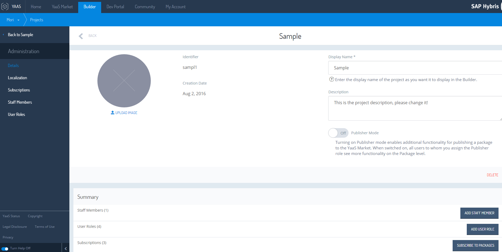
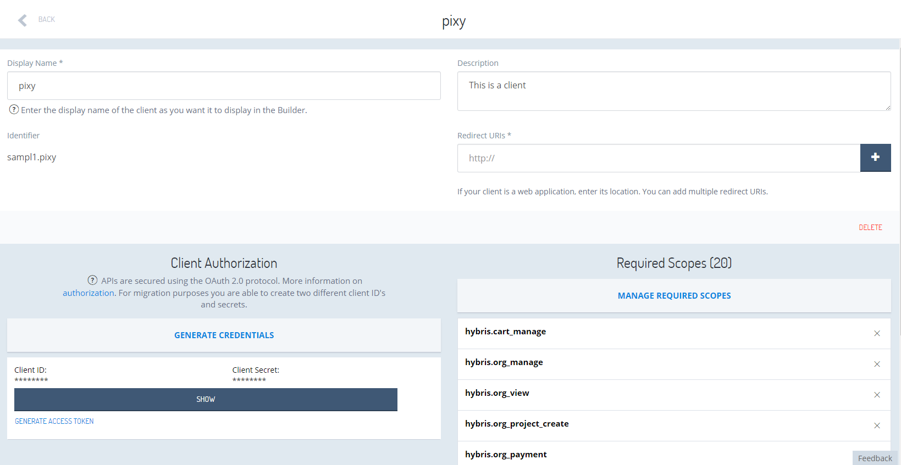
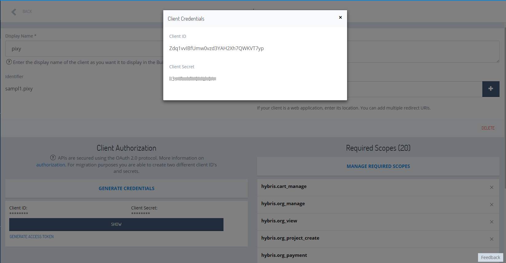
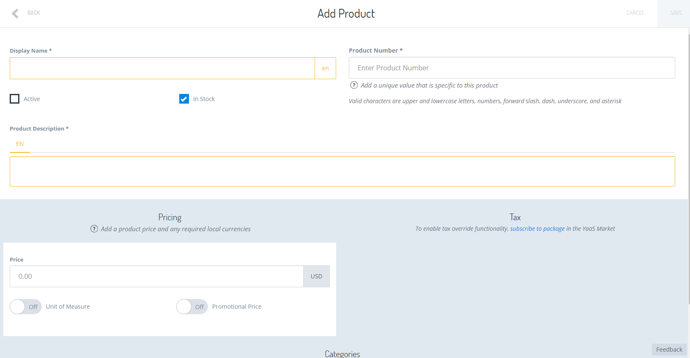

## Prerequisites  
- **Proficiency:** Intermediate
- **Tutorials:** [Extend the YaaS Storefront's Functionality](http://www.sap.com/developer/tutorials/yaas-extend-storefront-functionality-webservice.html)

## Next Steps
- [Deploy a Micro Service Built on YaaS on the SAP Cloud Platform](http://www.sap.com/developer/tutorials/yaas-deploy-run-microservice-cloud.html)

## Details
### You will learn  
In this tutorial you will use our own YaaS Project which you created earlier instead of the default one.

If you are not already familiar with [Node.js](https://www.youtube.com/watch?v=pU9Q6oiQNd0), follow this link to learn more. You will use it in this tutorial. The YaaS Storefront is based on  [Angular](https://docs.angularjs.org/guide/directive) and [Restangular](https://github.com/mgonto/restangular#starter-guide). If you are not already familiar with them and would like to dive into the code, you can follow the provided links to start learning.

### Time to Complete
**20 Min**.

---

[ACCORDION-BEGIN [Step 1: ](Complete Getting Started with YaaS)] 

If you have not completed the Getting Started with YaaS tutorial, please do it now. This is necessary in order to follow the next steps.   

[DONE]
[ACCORDION-END]

[ACCORDION-BEGIN [Step 2: ](Set project ID and client ID)] 

Take note of the YaaS **Project's identifier** and the YaaS **Client's identifier** and place these as the `PROJECT_ID` and `CLIENT_ID` values in the `gruntfile.js` in the `folder(1)` directory which you created in the previous tutorials. This is the root directory of your `yaas-storefront` project.

- You Can find **Project's identifier** in the **Builder** under the **Administration** tab when you open your project.

- You can find the client identifier by selecting your client from the list of **Clients**.

- In the **Client Authorization** section, use the **SHOW** button. Now you should be able to see the **Client ID**.

[DONE]
[ACCORDION-END]

[ACCORDION-BEGIN [Step 3: ](Rebuild the Storefront)] 

Rebuild the Storefront by running the `grunt build` command from `folder(1)` directory.

[DONE]
[ACCORDION-END]

[ACCORDION-BEGIN [Step 4: ](Rerun your Storefront)] 

Rerun your Storefront by running the `npm start` command from `folder(1)` directory. The client will now be talking with your YaaS Project.

[DONE]
[ACCORDION-END]

[ACCORDION-BEGIN [Step 5: ](Add products)] 

Add some products to start populating your Storefront with material.

- Go back to the builder and click on product / new product.
- Add a name, an identifier, a price, a description and check active.

- Click on save.
- (Optional) Add an image, click on save.

- Follow the same steps if you want to create additional products.
- In the end if you reload your storefront, you will be able to see the products you added.

> NOTE: It is important to set your products as **active**, otherwise they will not appear in your online store.

In this tutorial, you replaced the default storefront project credentials with your own YaaS project credentials. You added customized products to your storefront.    

[DONE]
[ACCORDION-END]

## Next Steps
- [Deploy a Micro Service Built on YaaS on the SAP Cloud Platform](http://www.sap.com/developer/tutorials/yaas-deploy-run-microservice-cloud.html)
