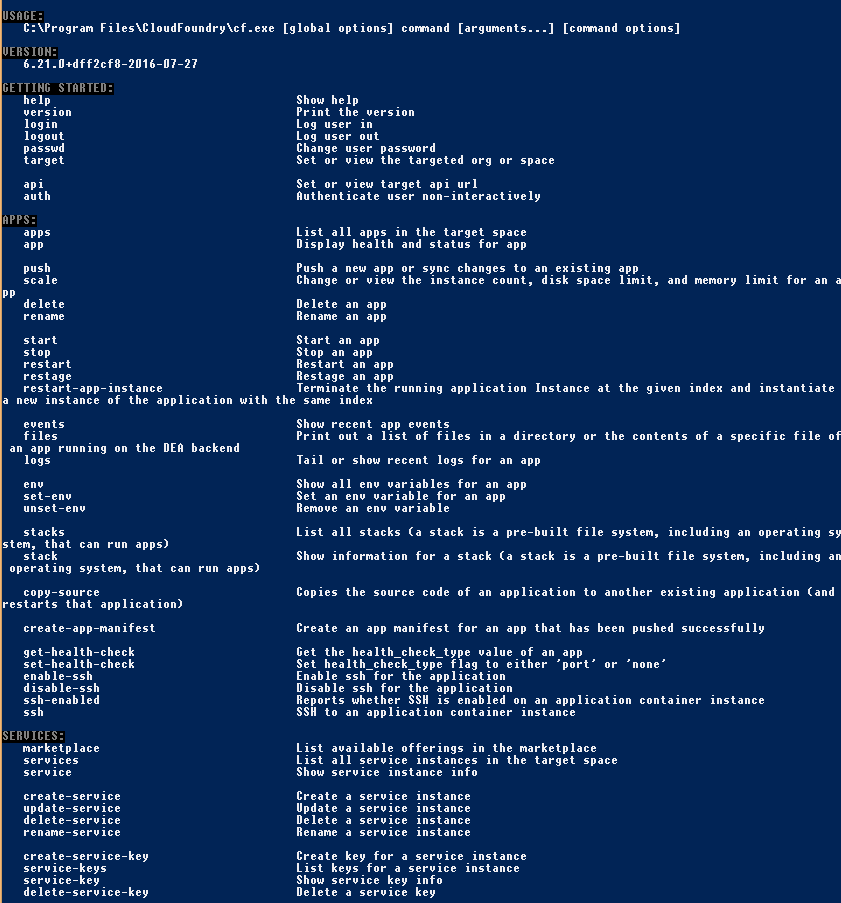
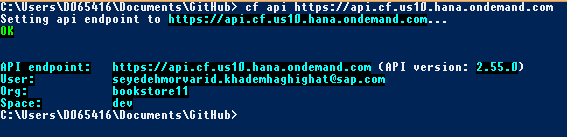
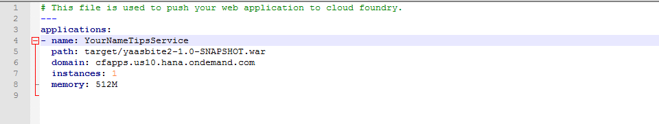
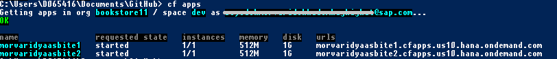
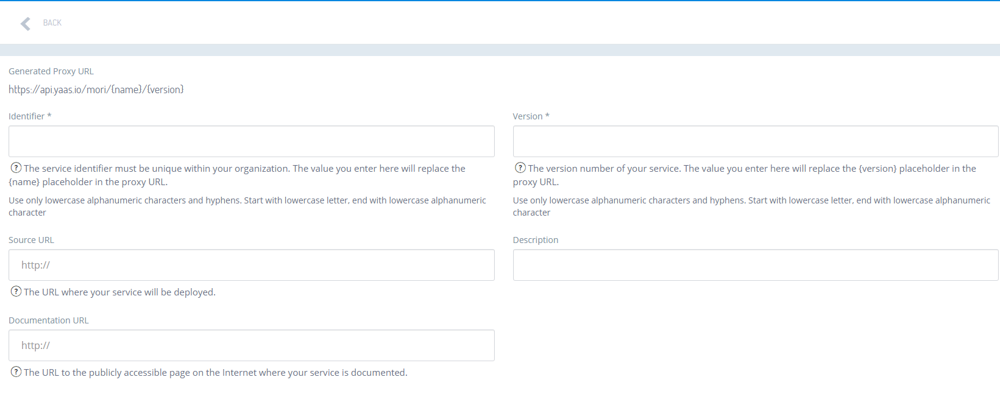

## Prerequisites  
 - **Proficiency:** Intermediate
 - **Background Knowledge:**  You will get most from this tutorial if you already have basic knowledge of [Node.js](https://www.youtube.com/watch?v=pU9Q6oiQNd0), [Angular](https://docs.angularjs.org/guide/directive) and [Restangular](https://github.com/mgonto/restangular#starter-guide). If you are not already familiar with them and would like to dive into the code, you can follow the provided links to start learning.
 - **Software Requirements:** Cloud Foundry CLI (Command line interface), Maven which we will download in this tutorial.
 - **Tutorials:**
    - [Getting Started with YaaS](http://go.sap.com/developer/tutorials/yaas-getting-started.html)
    - [Download and Run the Default YaaS Storefront](http://go.sap.com/developer/tutorials/yaas-download-run-default-storefront.html)   
    - [Extend the YaaS Storefront's Functionality](http://go.sap.com/developer/tutorials/yaas-extend-storefront-functionality-webservice.html)
    - [Use Your Own YaaS Project to Back your YaaS Storefront](http://go.sap.com/developer/tutorials/yaas-create-project-backing-storefront.html)

## Next Steps
 - Select a tutorial from the [Tutorial Navigator](http://go.sap.com/developer/tutorial-navigator.html) or the [Tutorial Catalog](http://go.sap.com/developer/tutorials.html)

## Details
### You will learn  
In this tutorial you will learn how to deploy a micro service to the SAP HCP. As an example you will use the Tips micro service created in [Extend the YaaS Storefront's Functionality](http://go.sap.com/developer/tutorials/yaas-extend-storefront-functionality-webservice.html) tutorial. In order to deploy a micro service you will need to set up your Cloud Foundry Command Line interface and create a SAP HCP account. In the end you will run the micro service on the cloud.

### Time to Complete
**20 Min**.

---

1. Download the **Cloud Foundry CLI**: Go to https://docs.cloudfoundry.org/cf-cli/install-go-cli.html, and install Cloud Foundry's CLI. Run `cf` commands from your command line to verify your installation.

    

2. Set the Cloud Foundry CLI's endpoint to SAP's HCP address, by running the command: `cf api https://api.cf.us10.hana.ondemand.com`

    

3. Go to **Builder**. Choose the YaaS Project which you created in the **Getting Started with YaaS** tutorial to subscribe to the **HCP, starter edition for cloud foundry services (beta)** package. This package allows you to develop, deploy and run services and applications.
    - Open your YaaS Projects **Administration** page.
    - Click **Subscription**, select **+ Subscription**, select the *Beta Worldwide* tab, and subscribe to the package called **HCP, STARTER EDITION FOR CLOUD FOUNDRY SERVICES (BETA)** in there.

4. Wait 10 seconds and your package will appear in **Builder***. If your package did not appear, log out and back in to the YaaS Builder, find your project, and you should see **SAP HANA Cloud Platform** in your YaaS Project's Menu on the left side of the page.

5. You should now get an email from **HCP**, guiding you through steps to **activate** your HCP account.

    > NOTE: You can skip this step if you already have an **HCP** Account.

6. You can then log in using the command `cf login`. After entering your credentials, your HCP Cloud foundry account will be ready to deploy to.

7. Familiarize yourself with the `manifest.yml` file which is located on the root folder of your Tips Service in your folder `(2)/yaasbite200`. This is the file that instructs your **Cloud Foundry CLI** where and how to deploy your war file.

    > NOTE: If you have skipped the tutorial [Extend the YaaS Storefront's Functionality](http://go.sap.com/developer/tutorials/yaas-extend-storefront-functionality-webservice.html), you can clone the Tips Micro Service with this command. `git clone https://github.com/SAP/yaas-getting-started-yaasbites.git`

8. Ensure your deployment name is unique to you, by adjusting the name value in the file `manifest.yml` to for example `yourNameTipsService`.  This will ensure that your application will not clash with other applications deployed to the same environment by other users.

    

9. Run `mvn -v` to confirm that you have maven installed. If not, follow instructions on [Apache Maven Website](https://maven.apache.org/install.html), and confirm that  `mvn -v` then runs.   Now build and package your micro service into a war file, by running the command `mvn clean package` from the folder `(2)/yaasbite200`.

10. Push the war file to the cloud, by running `cf push` from the same location. This will use the information in `manifest.yml` to guide the deployment.

11. Run `cf apps` to check whether the war file was successfully deployed and started and note the URL where it is running. It should be something like `yourAppsName.cfapps.us10.hana.ondemand.com`.

    > NOTE: The default HCP settings require the secure, https protocol. Therefore you must use https for all calls to your deployed services and when accessing your website in the cloud @ https://

    

12. Now that your service has been deployed to the cloud, you could access it directly from your StoreFront. However, YaaS is all about security, so instead we should  register this service in the YaaS Builder, so that instead, we can access it via the YaaS Security Proxy.  To register your service on YaaS:
    - Go to your YaaS Project's page.
    - Select **Services**, select **+ Service** and here you need to add the URL to your service on HCP: `yourAppsName.cfapps.us10.hana.ondemand.com`.
    - Enter the other required fields and then click **Save**.

    

    - Click the **Deploy** button and you will see a **Generated Proxy URL** which is the URL to your service on YaaS. Calls to this address will be checked by the YaaS Security framework and only if okay, passed along to your service.

    > NOTE: In order to access your service at the  **Generated Proxy URL** you will need to acquire an **Access Token**. This is because all calls to a service on YaaS are secured. If you are interested to learn more about this please refer to [YaaS Dev Portal](https://devportal.yaas.io/).  

###Summary
In this tutorial you learned how to deploy a micro service based on YaaS on HANA Cloud Platform and run the service.

## Next Steps
 - Select a tutorial from the [Tutorial Navigator](http://go.sap.com/developer/tutorial-navigator.html) or the [Tutorial Catalog](http://go.sap.com/developer/tutorials.html)
