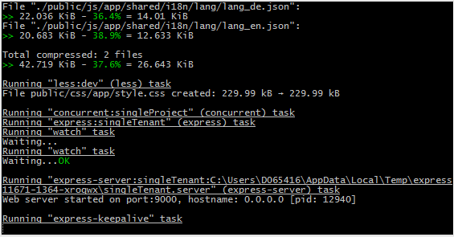
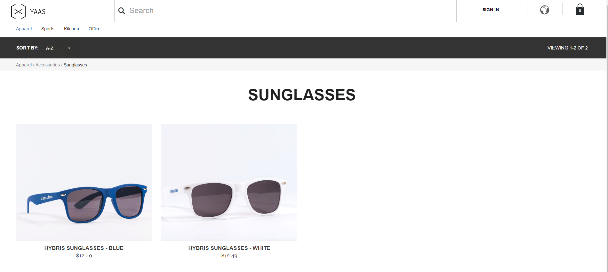

## Prerequisites  
- **Proficiency:** Intermediate
- **Tutorials** [Getting Started with YaaS](http://www.sap.com/developer/tutorials/yaas-getting-started.html))

## Next Steps
- [Extend the YaaS Storefront's Functionality](http://www.sap.com/developer/tutorials/yaas-extend-storefront-functionality-webservice.html)

## Details
### You will learn  
In this tutorial you will learn how to create your own e-commerce shop in minutes with the YaaS Storefront.

The YaaS Storefront is based on [Node.js](https://www.youtube.com/watch?v=pU9Q6oiQNd0),  [Angular](https://docs.angularjs.org/guide/directive) and [Restangular](https://github.com/mgonto/restangular#starter-guide). If you are not already familiar with these, and would like to dive into the code, you can follow the provided links to start learning.

### Time to Complete
**10 Min**.

---

[ACCORDION-BEGIN [Step 1: ](Install Node and Git)] 

Confirm that you have **Node.js** and **Git** installed:

- run the command `node -v` to see if you have **Node.js** installed.  If not, download it from <https://nodejs.org/en/download/>, and confirm that the command `node -v` runs okay.
- run the command `git`to see if you have **Git** installed.  If not, download it from <https://git-scm.com/book/en/v2/Getting-Started-Installing-Git>, and confirm that the command `git` runs okay.

[ACCORDION-END]

[ACCORDION-BEGIN [Step 2: ](Clone the YaaS StoreFront)] 

Clone the YaaS StoreFront:

- Create a folder which we will refer to as `(1)` in the following steps, and `cd` into it.
- Run `git clone https://github.com/SAP/yaas-storefront.git` to clone the StoreFront into `(1)`
- Confirm you now see the folder `yaas-storefront`	inside `(1)`, and `cd` into it.

[ACCORDION-END]

[ACCORDION-BEGIN [Step 3: ](Download dependencies)] 

Use Node's package manager to download the dependencies:

- The YaaS StoreFront includes `npm`, **Node.js**'s package manager, for downloading dependent packages.
- Run `npm install` to download all the packages the Storefront depends on.  The console should show `npm` downloading many dependencies; confirm this is the case.

[ACCORDION-END]

[ACCORDION-BEGIN [Step 4: ](Start a local web server)] 

Start a local web server

- Run the command `npm start` to start a local web server.  If your command prompt looks like the following image, you will know that the server is running.

[ACCORDION-END]

[ACCORDION-BEGIN [Step 5: ](Open your Storefront)] 

Open your own default Storefront

- Open a browser (we like Chrome) and go to `http://localhost:9000` where you should see your own StoreFront, ready for your pimping skills.
- Verify you can see and browse products in the Storefront.

You now have seen a default YaaS Storefront running locally on your machine. The next step is to customize and personalize it.  In the next tutorial you will add a feature to the StoreFront called "Mr Tip".  When browsing products, the undecided purchaser can click on "Mr Tip" to get advice, with helpful responses such as "Absolutely yes!!" and "One word: No".

[ACCORDION-END]

## Next Steps
- [Extend the YaaS Storefront's Functionality](http://www.sap.com/developer/tutorials/yaas-extend-storefront-functionality-webservice.html)
