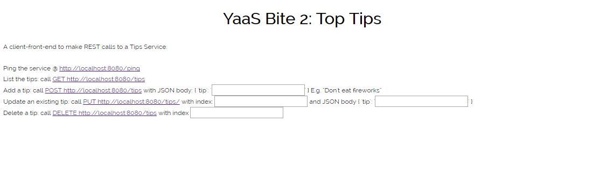
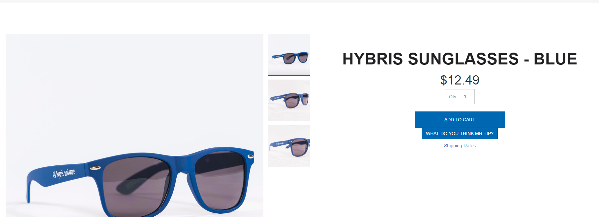

## Prerequisites  
 - **Proficiency:** Intermediate
 - **Background Knowledge:** You will get most from this tutorial if you already have basic knowledge of [Node.js](https://www.youtube.com/watch?v=pU9Q6oiQNd0), [Angular](https://docs.angularjs.org/guide/directive) and [Restangular](https://github.com/mgonto/restangular#starter-guide). If you are not already familiar with them and would like to dive into the code, you can follow the provided links to start learning.
 - **Software Requirements:** Java, Maven which you will download in this tutorial if not present.
 - **Tutorials**
    - [Getting Started with YaaS](http://www.sap.com/developer/tutorials/yaas-getting-started.html)
    - [Download and Run the Default YaaS Storefront](http://www.sap.com/developer/tutorials/yaas-download-run-default-storefront.html)

## Next Steps
 - [Use Your Own YaaS Project to Back your YaaS Storefront](http://www.sap.com/developer/tutorials/yaas-create-project-backing-storefront.html)
 - [Deploy a Micro Service Built on YaaS on the SAP Cloud Platform](http://www.sap.com/developer/tutorials/yaas-deploy-run-microservice-cloud.html)

## Details
### You will learn  
You will learn how to extend your Storefront using a micro service. The Storefront is structured around [Angular Modules](https://docs.angularjs.org/guide/module). The aim of this tutorial is to include a button in your Storefront's Product Details page that gives helpful Tips to the undecided purchaser, such as "This would add to your overall coolness", and "One word: No". To achieve this, you will run a new micro service locally to provide the tips, and add a button to your StoreFront that calls this. The tips are communicated via REST calls to your YaaS Storefront.

### Time to Complete
**20 Min**.

---

Locate your `yaas-storefront` folder which we will refer to below as (1).

1. View the default Angular Modules that are included in your Storefront @ `(1)/public/js/app`. You can extend the Storefront's functionality by adding your own Angular Modules to these.  In this tutorial you will add a new Angular Module to support the "Mr Tip" functionality.

    > NOTE: Each Angular Module provides the support for a specific piece of business functionality such as Products, Customers, Cart etc. Each contains all the different parts required for that particular logic in your application, such as controllers, services, filters, etc.

2. Create a folder `(2)` somewhere outside of your `yaas-storefront` folder, and `cd` into it.  Run `git clone https://github.com/SAP/yaas-getting-started-yaasbites.git`, to give you several new folders, two of which are relevant to us:
    - `(2)/yaasbite200` which contains a "Mr Tip" micro service and front-end-client for populating it, and
    - `(2)/yaasbitestorefrontdeltas` which contains changes that you will make to the Storefront to call it.

    In the next step we compile and deploy the "Mr Tip" service locally and populate it with Tips.  We then extend the StoreFront functionality to utilise that.

3. Compile and deploy the new micro service that stores and delivers Tips:
    - Run `javac -version` to confirm that you have Java installed. If not, follow instructions on [Oracle Website](http://www.oracle.com/technetwork/java/javase/downloads/index.html) to download and install the Java SE Development Kit.  Remember to set your `JAVA_HOME` environment variable to point to your JDK directory, and confirm that `javac -version` then runs.
    - Run `mvn -v` to confirm that you have maven installed. If not, follow instructions on [Apache Maven Website](https://maven.apache.org/install.html), and confirm that  `mvn -v` then runs.
    - Compile and package the micro service into a war file: Run the `mvn clean package` command from within `(2)/yaasbite200`.
    - Execute the micro service locally by running `java -jar target/yaasbite2-1.0-SNAPSHOT.war` from within `(2)/yaasbite200`.
    - Confirm that you can reach the front-end-client @`http://localhost:8080` and use this to populate the service with Tips such as "Oh My GOD YES!!!", "One word: No", "That would suit your hamster"

    

    > NOTE: Please keep the micro service running. You will use this in the next steps.

4. With the Tips micro service running locally, you can now extend your StoreFront to include a button on its product detail page, that calls this service, and thus provide tips to the undecided purchaser.  To do this you need to modify some files in the `yaas-storefront` folder `(1)`.   Place **all** the files that are in `(2)/yaasbitestorefrontdeltas/two` into their respective locations in the `yaas-storedfront` folder `(1)`, overwriting the original files:
    - For example: file `file product-detail-ctrl.js` located in `(2)/yaasbitestorefrontdeltas/two/public/js/app/products/controllers/product-detail-ctrl.js` should replace the one in `(1)/yaas-storefront/public/js/app/products/controllers/product-detail-ctrl.js`.

5. Next we want to compile the modified code.
    - We will compile the code using the build tool grunt, which we first need to download with the help of the node package manager: run the command: `npm install -g grunt-cli` from within folder `(1)`.
    - In folder `(1)`compile the changes with the command: `grunt build`, and confirm that you see the response `Done, but with warnings.`

6. Confirm that your Tip micro service is still running, then run `npm start` in folder `(1)`, to restart your Storefront web server.  Open the Storefront in Chrome @`http://localhost:9000` and browse to a product page.

7. Find and click the new button "What do you think Mr Tip" and click it.  Confirm that you then see a tip displayed in the button.

    

8. The "Mr Tip" button is getting its Tips from your Service. Open Chrome's Developer Tools (Chrome > View > Developer > Developer Tools) and observe the REST Traffic that is happening behind the scenes between the Storefront and your Service.

9. Search for `ADJUSTED_AS_NEEDED` in the files you added, to see how this extra logic has been added.

### Summary
In this tutorial you extended the YaaS Storefront functionality using the Tips micro service. The micro service provided tips to a button in the storefront in order to help undecided purchasers with their shopping. The next step will be to back the YaaS storefront with your own customized YaaS project.

## Next Steps
 - [Use Your Own YaaS Project to Back your YaaS Storefront](http://www.sap.com/developer/tutorials/yaas-create-project-backing-storefront.html)
 - [Deploy a Micro Service Built on YaaS on the SAP Cloud Platform](http://www.sap.com/developer/tutorials/yaas-deploy-run-microservice-cloud.html)
