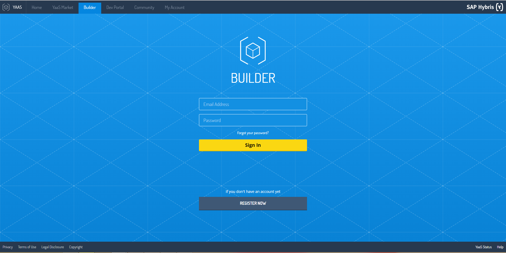
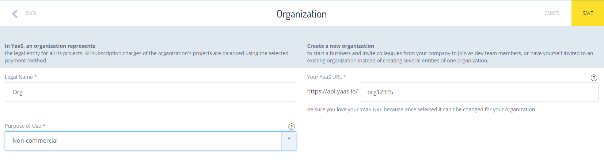
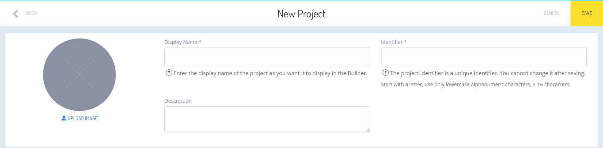
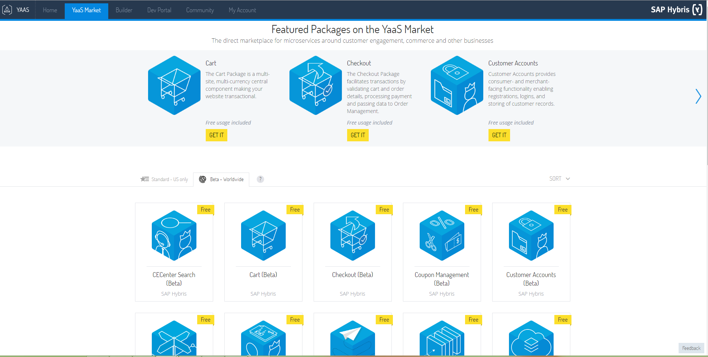
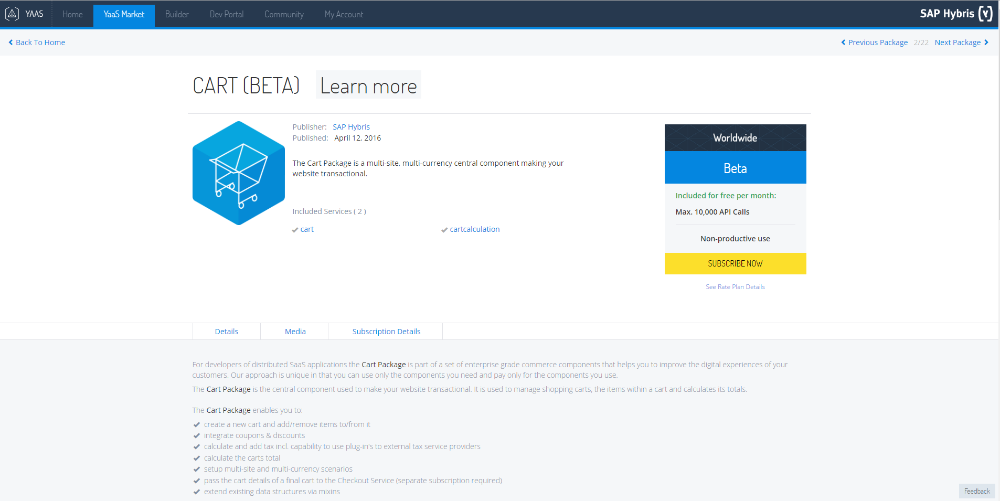
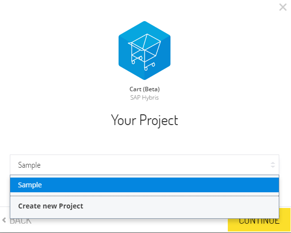
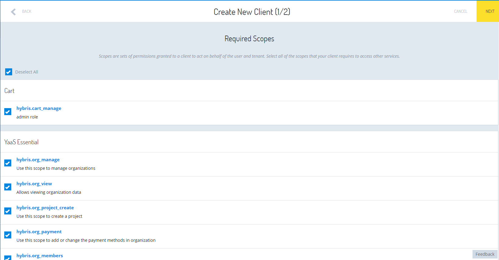
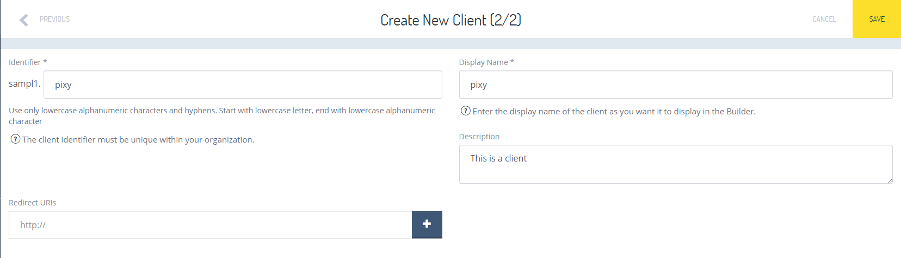

## Prerequisites  
 - **Proficiency:** Beginner

## Next Steps
 - [Download and Run the Default YaaS Storefront](http://www.sap.com/developer/tutorials/yaas-download-run-default-storefront.html)
 - [Extend the YaaS Storefront's Functionality](http://www.sap.com/developer/tutorials/yaas-extend-storefront-functionality-webservice.html)

## Details
### You will learn  
You will learn how to create your own YaaS project. This project will provide back-end support for a YaaS Storefront that you will be creating in the next tutorial. The starting point is the Builder which is the back-office client of YaaS. The Builder's main functionalities are the orchestration of YaaS Organizations, Projects and Packages, and the maintenance and management of some billing and sales data. You will also learn about the YaaS Market where you can subscribe to different packages of your choice, as well as sell packages of your own.

### Time to Complete
**10 Min**.

---
1. Create a new YaaS **Project**:
    - Register and sign in to the [Builder](https://builder.yaas.io/).

    

    - Create an **Organization**. Make sure to select **Non-Commercial** for your organization's **Purpose of Use**. You will then be navigated to your organization's detail page.

    

    - In the **Builder**, from your organization page choose **Administration** on the left side tab and then choose **Projects**. Use the **+ Project** button to create a new YaaS Project.
    - Complete the fields with the required information and save the form.

    

    > NOTE: Your **project Identifier** must be unique. It is validated in the Builder. You will use this in later steps so it is better to **save** it somewhere now.

    > TIP: You can switch the Turn **Help On** toggle button in the left navigation panel to see prompts.

2. SAP Hybris offers various YaaS functionalities grouped in to packages. Packages include a set of micro services and maintenance user interfaces called Builder modules. Each package has its distinct value proposition as well as a customer segment it addresses.   Your YaaS Project can use these packages if it first subscribes to them.  In order to support a YaaS storefront, your YaaS Project needs the functionality of 7 packages, so you need to subscribe to them now. Let's go through an example of subscribing to one package (Cart, beta package). The complete list of required packages is provided below:

    - Select your project, from **Projects** on the **Builder** home page.
    - From **Administration** menu in the left navigation, go to **Subscriptions**.
    - Use the **+ Subscription** button. You are then redirected to the **YaaS Market**.
    - Click on the Tab **Beta - Worldwide**. Beta packages are available free of charge and are intended for testing purposes in non-productive environments. They provide the same functionality as standard packages, but the number of requests or API calls per month is limited.

    

    - Choose the **Cart (Beta)** package and click on get it. You will be directed to the package Detail Page.

    

    - Click on **Subscribe Now** and select the project your package should be assigned to. In the example below the name of our project is "Sample".

    

    - Click **Continue** and then **Subscribe Now** to finalize your subscription.
    - Click **Configure It** to return to your project's main page.
    - In addition to **Cart (Beta)**, you need to subscribe to all **Checkout**, **Coupon Management**, **Customer Accounts**, **Order Management**, **Product Content** and **Site Management** packages. Follow the step 2 in order to subscribe to these packages.
    - Confirm that you see **7** subscriptions listed in your in your YaaS project's subscription page.  

3. Now that you have subscribed to these packages, your YaaS Project is now aware of them, but to be able to call the micro services in those packages, your YaaS Project needs to have a valid YaaS Client.  Create a new YaaS Client and select *all possible* required Scopes (permissions) while doing so. Follow the steps below:

    - Select your project from **Projects**.
    - In the left navigation panel, go to **Clients**.
    - Use the **+ Client** button.
    - Select all the scopes. Use the Next button to proceed to the Details section.

    

    - Complete the fields, such as in the example, and **Save** the form. Note that you can leave the Redirect URLs field blank. Confirm that you have one client listed in your project's client page.

    

### Summary
In this step, you created your own YaaS project and a YaaS client. You also learned how to subscribe to different packages on YaaS Market. The next step is downloading and running a default YaaS Storefront project which runs locally on your machine. You will browse through a storefront which is populated with products and services.    

## Next Steps
 - [Download and Run the Default YaaS Storefront](http://www.sap.com/developer/tutorials/yaas-download-run-default-storefront.html)
 - [Extend the YaaS Storefront's Functionality](http://www.sap.com/developer/tutorials/yaas-extend-storefront-functionality-webservice.html)
